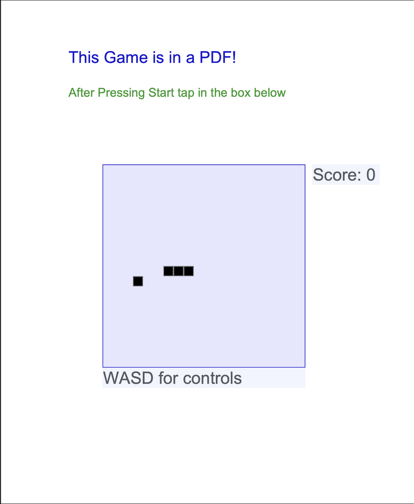

# 🐍 PDF Snake Game

An innovative implementation of the classic Snake game that runs entirely within a PDF file using PDF forms and JavaScript.



## 📋 Overview

This project demonstrates the capabilities of PDF as an interactive format by implementing a complete Snake game within a standard PDF document. The game leverages PDF forms and embedded JavaScript to create an interactive gaming experience in an unexpected medium.

## 🎮 Features

The Snake game implementation includes:

- A complete Snake game playable directly in Adobe Acrobat Reader
- WASD keyboard controls for navigation
- Score tracking and game progression
- Food generation and snake growth mechanics
- Collision detection for walls and self-intersection

## 🔧 Technical Implementation

The game is built using several PDF-specific techniques:

1. **Form Field Grid**: A 20×20 grid of interactive form elements creates the game field
2. **JavaScript Game Logic**: Embedded JavaScript handles:
   - Snake movement and growth
   - Food spawning
   - Collision detection
   - Score tracking
3. **PDF Interactive Elements**: Utilizes buttons and form fields for rendering

## 🚀 Getting Started

### Prerequisites

- Python 3.x
- Adobe Acrobat Reader (or any PDF reader that supports JavaScript execution)

### Installation and Play

1. Generate the game PDF:
   ```
   python main.py
   ```

2. Open `out_snake_game.pdf` with Adobe Acrobat Reader or a chromium based browser

3. Click "Start" to begin the game

4. Control the snake with:
   - WASD keys
   - On-screen control buttons

### Customization

The game can be customized by modifying these variables in the source code:

- `PX_SIZE`: Pixel size (default: 15)
- `GRID_WIDTH`: Game grid width (default: 20)
- `GRID_HEIGHT`: Game grid height (default: 20)
- `GRID_OFF_X/Y`: Grid position offsets (defaults: 150, 250)
- `TICK_INTERVAL`: Game update interval in milliseconds (default: 180)

## ⚙️ Development Details

The project was built without external PDF libraries, using a custom approach:

1. A Python script generates the PDF file with all necessary objects
2. JavaScript is embedded for game logic
3. Form elements are programmatically created to serve as visual elements

## ⚠️ Known Limitations

- Performance depends on the PDF reader's JavaScript engine capabilities
- Some PDF readers may block JavaScript execution for security reasons
- Limited mobile device support
- Not all PDF readers support the required interactive features

## 🔍 Future Development Opportunities

- Sound effects integration
- Multiple difficulty levels
- Local high score tracking
- Additional game modes

## ⚖️ License

This project is open source and available under the MIT License.